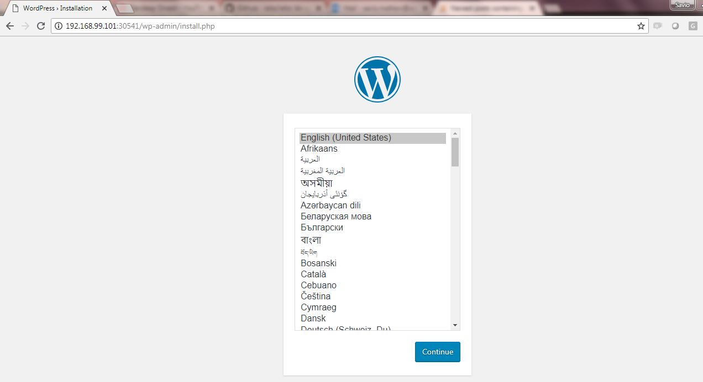

# Run WordPress on Kubernetes

Objectives: WordPress Kubernetes cluster setup
- Create PersistentVolumeClaims and PersistentVolumes
- Create a Secret
- Deploy MySQL
- Deploy WordPress

## Create PersistentVolume

```
]#kubectl apply -f pv.yaml
persistentvolume "wordpress-pv" created
```

## Create a Secret for MySQL Password

```
]#kubectl apply -f mysqlsecret.yaml
secret "mysecret" created
]#kubectl get secrets
NAME                  TYPE                                  DATA      AGE
default-token-tlmml   kubernetes.io/service-account-token   3         4d
mysecret              Opaque                                2         1m
```

## Deploy MySQL

```
]#kubectl apply -f mysql-deployment.yaml
service "wordpress-mysql" created
persistentvolumeclaim "mysql-pvclaim" created
deployment.extensions "wordpress-mysql" created

]#kubectl get service
NAME              TYPE        CLUSTER-IP       EXTERNAL-IP   PORT(S)    AGE
wordpress-mysql   ClusterIP   10.109.211.230   <none>        3306/TCP   3m

]#kubectl get deployments
NAME              DESIRED   CURRENT   UP-TO-DATE   AVAILABLE   AGE
wordpress-mysql   1         1         1            1           3m

]#kubectl get pvc
NAME            STATUS    VOLUME                                     CAPACITY   ACCESS MODES   STORAGECLASS   AGE
mysql-pvclaim   Bound     pvc-09922a9c-84dd-11e8-9952-080027339265   10Gi       RWX            standard       1m

]#kubectl get pods
NAME                               READY     STATUS    RESTARTS   AGE
wordpress-mysql-5d8469f7bf-5zn82   1/1       Running   0          4m
```

## Deploy WordPress

```
]#kubectl create -f wordpress-deployment.yaml
service "wordpress" created
persistentvolumeclaim "wp-pvclaim" created
deployment.apps "wordpress" created

]#kubectl get pvc
NAME            STATUS    VOLUME                                     CAPACITY   ACCESS MODES   STORAGECLASS   AGE
mysql-pvclaim   Bound     pvc-09922a9c-84dd-11e8-9952-080027339265   10Gi       RWX            standard       5m
wp-pvclaim      Bound     pvc-a4986157-84dd-11e8-9952-080027339265   20Gi       RWO            standard       53s

kubectl get services wordpress
NAME        TYPE           CLUSTER-IP      EXTERNAL-IP   PORT(S)        AGE
wordpress   LoadBalancer   10.102.246.11   <pending>     80:30541/TCP   1m
```

## Access the app

```
]#minikube service wordpress --url
http://192.168.99.101:30541
```
